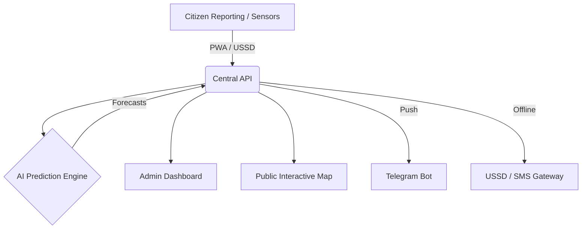

<div align="center">

# 🏛️ SAKSHAM
### Smart Alert and Knowledge System for Hazard Awareness and Management
**🥈 Runner-Up @ Smart India Hackathon (SIH) 2025**

[](https://www.sih.gov.in/)
[](https://reactjs.org/)
[](https://nodejs.org/)
[](https://www.mongodb.com/)
[](./LICENSE)

---

> *"An intelligent, multi-platform ecosystem designed to revolutionize disaster preparedness and response for Bharat."*

[Explore Modules](#-the-saksham-suite) • [Quick Start](#-quick-start) • [Tech Stack](#-tech-stack) • [Why We Won](#-winning-edge)

</div>

---

## ⚡ What is SAKSHAM?

**SAKSHAM** is a mission-critical disaster management ecosystem developed for **SIH 2025**. It bridges the gap between high-tech AI predictions and ground-level accessibility. Whether you're an official in a command center or a citizen with a 2G feature phone, SAKSHAM keeps you safe.

### 🎯 Key Impact Areas
| Impact | Description |
| :--- | :--- |
| 🛡️ **Prevention** | AI predicts floods, earthquakes, and fires before they strike. |
| 📢 **Propagation** | Alerts reach Web, Mobile, Telegram, and USSD (No Internet needed). |
| 🤝 **Preparedness** | Gap analysis for local training and resource capacity building. |
| 📊 **Policy** | Data-driven dashboards for NDMA/SDMA officials. |

---

## 📦 The SAKSHAM Suite

We built **7 specialized modules** that work in perfect harmony:

| Icon | Module | Core Functionality | Platform |
| :---: | :--- | :--- | :--- |
| 🤖 | **AI Prediction** | ML models for Flood, Fire & Earthquake | Cloud Engine |
| ⚙️ | **Central API** | The "Brain" - Secured with Clerk & JWT | Backend |
| 📊 | **Admin Desk** | Real-time analytics & resource tracking | Web (Admin) |
| 🗺️ | **GIS Map** | Live disaster visualization & heatmaps | Interactive Web |
| 📱 | **Citizen PWA** | Offline-ready app for alerts & reporting | Mobile Web |
| 📞 | **USSD Portal** | Internet-free emergency access (*888#) | Feature Phone |
| 💬 | **Telegram Bot** | Instant localized push notifications | Messaging |

---

## 🚀 Get Started

### 🛠️ Global Prerequisites
*   **Node.js** (v18.x+)
*   **MongoDB** (Local or Atlas)
*   **Git** (For cloning)

### ⚡ Rapid Installation

```bash
# 1. Clone the entire ecosystem
git clone https://github.com/rajstories/Saksham_SIH-Final.git
cd Saksham_SIH-Final

# 2. Setup Backend (The Brain)
cd FinalCode/NDMA-Saksham-BackEnd-main/NDMA-Saksham-BackEnd-main
npm install && npm start

# 3. Launch Dashboard (The Eyes)
cd ../../Saksham_Dashboard-main/Saksham_Dashboard-main
npm install && npm run dev
```

---

## 🏗️ Technical Architecture



---

## 🛠️ Tech Stack

### 🎨 Frontend & UI


### ⚙️ Backend & AI


### 🔧 Utilities & Tools


---

## 🏆 Winning Edge

**What set SAKSHAM apart at SIH 2025?**

*   **🌐 True Multi-Platformity**: We don't just target iPhone users. Our **USSD engine** ensures the person in the remotest village of Odisha gets an alert on their Nokia 1100.
*   **⚡ Offline-First Philosophy**: Disasters destroy infrastructure. Our PWA uses **IndexedDB** to local-cache data and sync when the network returns.
*   **🤖 Responsible AI**: We use generative AI not just for predictions, but for **training gap analysis**, recommending specific drills for specific districts.
*   **📍 Hyper-Local GIS**: Our maps don't just show disasters; they show the nearest **NDRF units, blood banks, and food shelters** in real-time.

---

## 🌪️ Disaster Coverage Matrix
| Hazard | Prediction Model | Alert Trigger | Strategy |
| :--- | :---: | :---: | :--- |
| **Flood** | RNN-LSTM | Threshold Cross | Evacuation Routes |
| **Earthquake** | Seismic ML | Wave Detection | Shelter Mapping |
| **Forest Fire** | Thermal Imaging | Heat Anomaly | Fire Containment |
| **Cyclone** | Path Matrix | Wind Velocity | Coastline Shield |

---

## 🤝 Roadmap & Contributing

1.  **Phase 1**: Regional Language Support (Hindi, Bengali, Marathi, etc.) 🏗️
2.  **Phase 2**: Real-time Satellite Imagery Integration 🛰️
3.  **Phase 3**: IoT Sensor Network Mesh 📡

We love contributors! If you have an idea to make India safer, **Fork & PR!**

---

<div align="center">

### 🌟 Give this project a STAR if you liked it! 🌟

**Developed with 🧡 for SIH 2025**
[Contact Us](https://github.com/rajstories) • [Report Bug](https://github.com/rajstories/Saksham_SIH-Final/issues)

</div>

